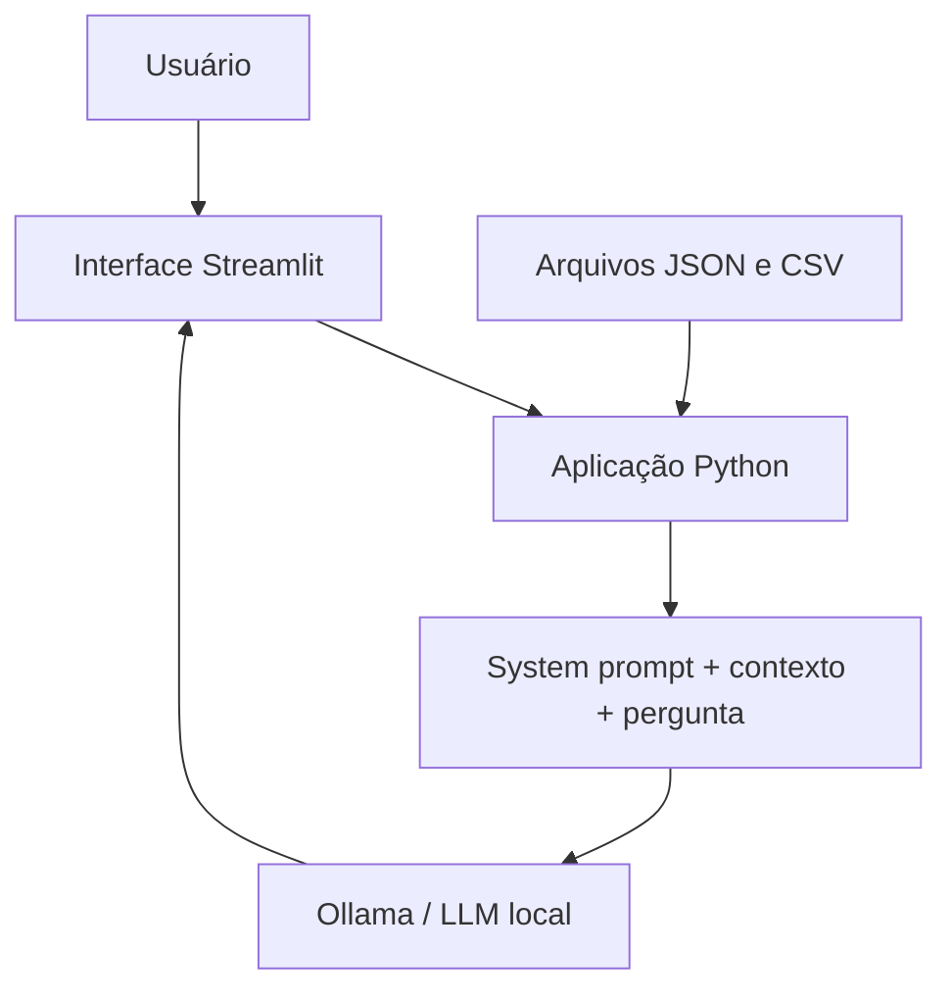

# FinEdu — Assistente de Educação Financeira

O FinEdu é um assistente virtual criado para o desafio final do Bootcamp Bradesco + DIO. Ele explica conceitos de finanças pessoais e usa dados fictícios para responder perguntas de forma simples e contextualizada.

## Problema

Pessoas iniciantes podem ter dificuldade para entender seus gastos, organizar uma reserva de emergência e compreender produtos financeiros.

## Solução

O FinEdu usa um modelo local executado pelo Ollama e os dados mockados fornecidos pela DIO para oferecer explicações educativas. Ele não recomenda investimentos e não substitui um profissional financeiro certificado.

## Funcionalidades

- Explicação de conceitos básicos de finanças pessoais.
- Consulta às transações fictícias da base.
- Explicação dos produtos financeiros cadastrados.
- Contextualização com o perfil e o histórico fictícios do cliente.
- Recusa de recomendações de investimento e perguntas fora do escopo.
- Aviso quando uma informação não está disponível.

## Tecnologias

- Python
- Streamlit
- Pandas
- Requests
- Ollama com o modelo local `gemma3:1b`
- JSON e CSV

## Arquitetura



Os quatro arquivos da pasta `data/` são carregados pela aplicação e incluídos diretamente no contexto enviado ao modelo. Esta versão não utiliza RAG nem banco vetorial.

## Estrutura

```text
├── data/       # Dados fictícios fornecidos pela DIO
├── docs/       # Documentação das etapas do desafio
├── src/
│   └── app.py  # Aplicação Streamlit
├── assets/     # Materiais do repositório-base
└── examples/   # Referências do repositório-base
```

## Como executar

1. Instale as dependências:

   ```bash
   pip install streamlit pandas requests
   ```

2. Instale o [Ollama](https://ollama.com/) e baixe o modelo:

   ```bash
   ollama pull gemma3:1b
   ```

3. Inicie o Ollama em um terminal:

   ```bash
   ollama serve
   ```

4. Na raiz do projeto, execute:

   ```bash
   streamlit run src/app.py
   ```

## Exemplos de uso

- Quanto gastei com alimentação?
- O que é reserva de emergência?
- Como funciona o Tesouro Selic?
- Qual investimento você recomenda para mim?

## Avaliação

Foram executados quatro cenários com o modelo `gemma3:1b` para avaliar assertividade, segurança e coerência. Dois atenderam ao resultado esperado e dois mostraram limitações do modelo leve. As respostas reais estão registradas em [`docs/04-metricas.md`](docs/04-metricas.md).

## Limitações

- Utiliza somente dados fictícios.
- Não acessa contas bancárias ou dados reais.
- Não recomenda investimentos específicos.
- Não consulta informações financeiras em tempo real.
- Não mantém histórico das conversas.
- O modelo leve pode cometer erros de cálculo ou não seguir todas as instruções, conforme registrado nos testes.

## Pitch

O roteiro está disponível em [`docs/05-pitch.md`](docs/05-pitch.md). O vídeo ainda será gravado e seu link está pendente.
